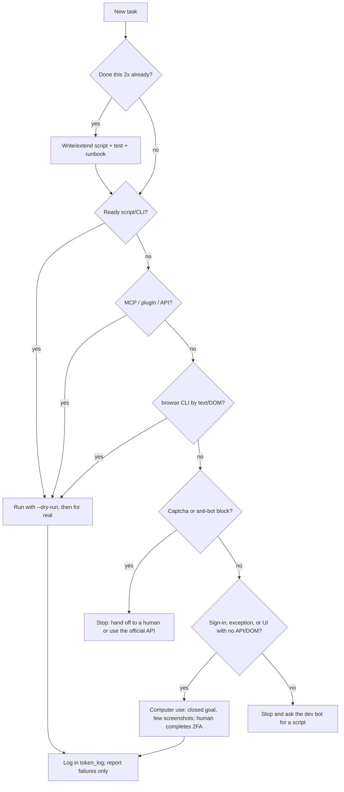

# Token economy for Grok Bots

**Permanent rule for all bots.** **Golden rule:** the LLM plans, reviews and handles exceptions. Deterministic code
(script, CLI, MCP, API) does the work. Repeated work becomes a Python function.

## 1. Preference order (cost ladder)

Step down a rung only when the one above cannot do it. Note why.

**Captcha / anti-bot block → stop and hand off to a human, or use the official API.** Computer use is never a way to defeat a block.

| # | Path | Typical cost | Use for |
|---|---|---|---|
| 1 | Ready script/CLI (`queue.py`, `video-cli`, `board.py`) | ~0 tokens beyond the command + short output | anything that already has a script |
| 2 | MCP connector (Drive, Gmail, GitHub, Calendar) | low, structured output | read/search/create in connected services |
| 3 | Installed plugin/skill (e.g. `browse skills find <site>`) | low | ready-made third-party recipe |
| 4 | Direct API (REST via `curl`/Python, `gh api`) | low/medium | when there is no MCP |
| 5 | Scripted browser: `browse` CLI reading text/DOM (`snapshot`, `get text`, `get markdown`) | medium | sites without an API; **no screenshots** |
| 6 | Computer use with screenshots | **high** (every screenshot is expensive) | **only** sign-in (a human completes 2FA), exceptions, and UIs with no API or scriptable DOM |

## 2. Pre-browser checklist (mandatory)

Before any `browse open` or computer-use subagent, answer:

1. Is there a script/CLI? → `ls <scripts-dir>`, `rg -l '<task>' <runbook-dir>`, `<cli> --help`.
2. Is there an MCP connector? → discover the server's tools and use them.
3. Is there a plugin/skill? → `browse skills find <domain>`.
4. Is there an API? → `gh api`, the service's REST API, `UploadFile`/`DownloadFile`.
5. Can the `browse` CLI do it by text? → `browse snapshot` / `browse get text body`.
6. Only then: computer use, with a closed goal and few screenshots (sign-in with a human completing 2FA, exceptions, UIs with no API or scriptable DOM).
7. Hit a captcha or anti-bot block at any point? Stop and hand off to a human, or use the official API.

If any of 1–5 is "yes", **do not open the browser**.

## 3. "Turn it into a script" rule

- Same task showed up **twice**? Stop. Write or extend a script (or ask the dev bot).
- Every new script has: `--help`, `--dry-run`, idempotency (running twice does not duplicate), `--selftest` or a test, short output (essentials and failures only).
- Document it in the runbook (1 line: command + when to use it). An undocumented script does not exist for the next agent.
- Prefer **extending** an existing script over creating a similar one.

## 4. Scripts in our flow (examples; check `--help` first)

Names here are generic. Map each one to the real script listed in your runbook.

| Task | Ready path | Never |
|---|---|---|
| Control spreadsheet | `queue.py next --country <country> --all`, `queue.py show <ITEM_ID>`, `queue.py mark <ITEM_ID> --status "..." --note "..."`, `queue.py lock/unlock` (the only way to edit it) | edit the spreadsheet by hand or with ad hoc openpyxl |
| Record a step (spreadsheet + Paperclip together) | `record_step.py` (one command) | two separate manual records |
| Coordination board (Paperclip) | `board.py` (REST helper) | open the UI in the browser to comment |
| Videos | `video-cli` (`validate`, `voice`, `render`, `check <dir>` in seconds before rendering); the exact watermark-free final command lives in the item folder's `FINAL-COMMAND.md` | build a render command from memory |
| Video QA | `qa.sh` + **one** look at the contact sheet | watching the video several times / dozens of screenshots |
| Drive / Gmail | `google_api.py` (OAuth: Drive upload, Gmail read-only) or the Drive/Gmail MCP connector, `UploadFile`/`DownloadFile` | Drive web in the browser |

If one of these does not exist on the box yet, use the next rung of the ladder and ask the dev bot to build it.

### Quick examples (❌ expensive → ✅ cheap; details in `examples/flows.md`)

- **Spreadsheet:** ❌ open the xlsx/Sheets and edit cells → ✅ `queue.py mark <ITEM_ID> --status "..." --note "..."` (or `record_step.py` for spreadsheet + board).
- **Drive:** ❌ Drive web with screenshots → ✅ Drive connector search in `<DRIVE_FOLDER_ID>` (already there?) and `UploadFile`/`google_api.py` only if missing.
- **Paperclip:** ❌ open the board in the browser → ✅ `board.py` reads the last N comments and posts 1 line with the proof path.
- **Video:** ❌ build the render by hand and watch it 3× → ✅ `video-cli check`, then the exact command from `FINAL-COMMAND.md`, `qa.sh` + 1 contact sheet.
- **Gmail:** ❌ Gmail web → ✅ MCP connector: draft → human OK → send.
- **IG/WhatsApp:** ❌ computer use clicking chat by chat → ✅ official API; without it, `browse` on the signed-in session, 1 approved send at a time.

## 5. Batches: CSV/JSON + script, never field by field

- Build a CSV/JSON with every row and process it with a script. Never type field by field into a UI.
- Prospect flow: `list.csv` → **script cards batch** → **voice batch** → **visual batch + render**.
- Stop at the first quota error; continue only with what does not depend on it.
- Report **only failures** (`3/40 failed: <ITEM_ID> voice 429, ...`), never the full list of successes.

## 6. Read and search without waste

- Search with `rg -n '<term>' <dir>`; read with `Read` using `offset`/`limit` only around the hit.
- Never dump a whole file (`cat` of 500 lines, `--full`, giant JSON). Use `jq`, `rg -m`, `wc -l` first.
- Do not re-read what you already read in this task. Note the fact and move on.
- No `sleep`/polling loops. Run in the background and wait for the completion notice (`AwaitShell` only when blocked).
- Command output: filter it (`--jq`, `rg`, `tail` of the error log); do not pull whole logs into context.

## 7. Cheap browser (when there is no other way)

- `browse` CLI first: `browse open <url> --session <task>` → `browse snapshot` → `browse click @0-5` → `browse snapshot`. Refs change on every snapshot.
- Read by text: `browse get text body`, `browse get markdown "#main"`. Screenshot only when layout matters.
- Reuse sessions and logins that are already open (box Chrome, `--auto-connect` when intended, contexts). Never sign out or switch accounts.
- One `--session` per parallel task; `browse stop --session <name>` when done.
- Same command failed twice? Stop: `browse doctor --json` and change approach.
- Computer use: closed goal ("sign in and stop"), **one screenshot per meaningful moment** (before sending, proof of the send), then hand control back to the script.

## 8. Browser automation: which tool to use

| Tool | When to use | Note |
|---|---|---|
| `browse` CLI | **default** on the box for scripted text/DOM flows (`snapshot`, `get text`, refs `@0-5`) | named sessions, reuses logins; screenshot only if layout matters |
| Browser Use | semi-structured flows where an LLM agent must decide the path on the page | spends tokens per step: use sparingly with a closed goal; script it once the flow stabilizes |
| Playwright | deterministic flows that will repeat, tests, stable scraping of own/permitted sites | best target for "turn it into a script" (section 3) |
| Selenium | simple or legacy flows that already exist in Selenium | do not start new projects in it if Playwright works |
| Computer use (screenshots) | sign-in (a human completes 2FA), exceptions, UIs with no API or scriptable DOM | last resort (section 1); never to get past a captcha or anti-bot block |

- **Forbidden:** `undetected-chromedriver` (or any anti-bot evasion tool) for Instagram/WhatsApp. Evading detection breaks the platforms' terms and risks banning the owner's accounts.
- No technique for bypassing anti-bot systems, captchas or terms of service goes into any script, skill or message. If a site blocks you, the answer is the official API or a human.

## 9. Sends to clients (IG DM, WhatsApp Web, Gmail) and anti-block posture

- **Every video needs the owner's human OK for that file** before it goes out. Silence is not approval.
- Text only from an **approved template**. Messages sent in the owner's name → **draft** for approval, never a direct send without an explicit request.
- Gmail: MCP connector/API (draft → approval → send). Never through the browser.
- **Official API first** where it exists: WhatsApp Business Platform (Cloud API), Instagram Graph API / Messaging API. They require a business account, Meta-approved templates and opt-in rules: check before using.
- No API available: **conservative** automation with `browse` on the already signed-in session:
  - human pace (one send at a time, minutes between sends), low daily cap, the client's business hours;
  - **no mass sending**; one individual message per business;
  - human approval of **each** send;
  - **stop at the first warning** (action block, challenge, verification, captcha, "unusual activity") and hand off to a human. Do not retry, do not switch accounts.
- **Real risk:** IG/WA automation can get the account blocked. Say so to whoever asks for the send.
- Idempotency: before sending, check whether the video is already in the conversation. If it is, **do not resend**.

## 10. Templates, cache and reuse

- **Approved hooks per sector**: reuse them; do not write a new hook for every client.
- **Approved TTS audio** (WAVs + a timing lock file): redoing visuals = **zero** TTS. The hash cache prevents repeat calls.
- **Visual presets** per sector/country; render from a template/contract, never one LLM per video.
- **Music rotation:** no track repeats within each block of 15 videos (record the track used).
- **Messages:** 1st message = `Your video is ready, here's the preview.` + mp4 (or the approved template for that language); **one** reminder after 3 days; **never a price** in a proactive message.

## 11. Quota and money guardrails (non-negotiable)

- **Never spend paid credits without the owner's explicit OK**: TTS beyond quota, clipping credits, ads, paid renders (paid Colab/Kaggle), purchases.
- Respect quota-lock files (e.g. a `<resource>-locked-until` file in the runbook folder). A future date = closed door.
- 429/quota error: stop **all** use of that resource, write the resume time to the lock file, continue with what does not depend on it.
- Never switch keys/projects/accounts to "get around" a quota. Never print or copy credentials.

## 12. Cheap file safety

- `--dry-run` first on everything that writes. Test on a **copy** (`/tmp/...`) before the live file.
- Backup → write to a temp file → atomic swap (`mv tmp final`).
- Small edits (diff/line) instead of rewriting the whole file.
- Take a lock before touching a shared item; release it when done.

## 13. Bot-to-bot messages

- Short: `[Project/Item] what changed · what I need · where it is (path)`.
- No repeated context: point to the file (`see <runbook-dir>/<file>.md §1.5`).
- Priority only when the recipient **must act**.
- Batch several items into one message. No "ok/received/thanks"-only messages.
- Summary instead of transcript; logs go to a file, the message carries the path.

## 14. Model and delegation

- Mechanical task (rename, record, run a batch, format) → low effort / cheap model.
- High effort only for judgment: approval, new copy, exceptions, legal decisions.
- Long work (render, batch, big upload) → background or subagent; do not hold the turn waiting.

## 15. Metric

Log tokens/cost per task whenever possible:

```bash
python3 scripts/token_log.py add --agent "<bot>" --task "render <ITEM_ID>" \
  --path script --tokens 1200 --cost 0.00 --notes "local render"
python3 scripts/token_log.py summary   # totals per path
```

Several agents share one log file? Add `--lock`. Set `TOKEN_LOG_FILE` to a fixed path so logs do not land in random folders.

Review the summary: if `computer-use` or `browse` dominate, a script is missing (back to section 3).

## 16. What wastes tokens (anti-patterns)

- Opening the browser for something that has an MCP/API/script.
- A screenshot per click; watching a video for QA instead of a script.
- `cat` of a whole file; re-reading the same file; pasting logs into the conversation.
- Polling with `sleep` in a loop.
- Typing a batch field by field into a UI.
- Regenerating what is cached (TTS, render, approved hook).
- Long bot-to-bot messages repeating context; empty acks.
- Doing the same thing by hand for the 3rd time.
- An expensive model/high effort for a mechanical task.
- Insisting on a site that blocked you (or trying to evade anti-bot) instead of using the official API or calling a human.

## 17. Decision flow



## 18. Maintenance (permanent rule)

This skill applies to **all bots, always**. It only works if it stays current:

- A cheaper path showed up (new script, MCP connector, API, plugin, new CLI flag)? **Update the skill**: open a PR on the `grokbot-economy` repo changing `SKILL.md` plus an entry under `## [Unreleased]` in `CHANGELOG.md` (Keep a Changelog format: what changed, why, estimated savings).
- A path became obsolete or broke: remove or fix it in the same PR.
- Small, focused changes, in English; no sensitive data (tokens, emails, phone numbers, file IDs, client names, internal URLs). Use placeholders like `<DRIVE_FILE_ID>`.
- No GitHub access? Ask the dev bot or the coordinator to open the PR with the ready text.
