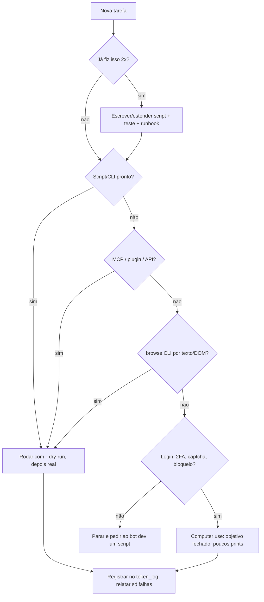

# Economia de tokens para Grok Bots

**Regra permanente para todos os bots.** **Regra de ouro:** o LLM planeja, revisa e trata exceções. Quem executa é código
determinístico (script, CLI, MCP, API). Trabalho repetido vira função Python.

## 1. Ordem de preferência (escada de custo)

Desça um degrau só quando o de cima não resolve. Anote o motivo.

| # | Caminho | Custo típico | Use para |
|---|---|---|---|
| 1 | Script/CLI pronto (`fila.py`, `simplicio-video`, `pc.py`) | ~0 tokens além do comando + saída curta | tudo que já tem script |
| 2 | Conector MCP (Drive, Gmail, GitHub, Calendar) | baixo, saída estruturada | ler/buscar/criar em serviços conectados |
| 3 | Plugin/skill instalado (ex.: `browse skills find <site>`) | baixo | receita pronta de terceiros |
| 4 | API direta (REST via `curl`/Python, `gh api`) | baixo/médio | quando não há MCP |
| 5 | Navegador por script: `browse` CLI lendo texto/DOM (`snapshot`, `get text`, `get markdown`) | médio | sites sem API; **sem prints** |
| 6 | Computer use com screenshots | **alto** (cada print custa caro) | **só** login, 2FA, captcha, exceções e sites que bloqueiam automação |

## 2. Checklist antes do navegador (obrigatório)

Antes de qualquer `browse open` ou subagente de computer use, responda:

1. Existe script/CLI? → `ls /workspace/controle/scripts`, `rg -l '<tarefa>' /workspace/controle`, `<cli> --help`.
2. Existe conector MCP? → descubra as tools do servidor e use.
3. Existe plugin/skill? → `browse skills find <domínio>`.
4. Existe API? → `gh api`, REST do serviço, `UploadFile`/`DownloadFile`.
5. O `browse` CLI resolve por texto? → `browse snapshot` / `browse get text body`.
6. Só então: computer use, com objetivo fechado e poucos prints.

Se a resposta 1–5 for "sim", **não abra o navegador**.

## 3. Regra "vira script"

- A mesma tarefa apareceu **2 vezes**? Pare. Escreva ou estenda um script (ou peça ao bot dev).
- Todo script novo tem: `--help`, `--dry-run`, idempotência (rodar 2× não duplica), `--selftest` ou teste, saída curta (só o essencial e as falhas).
- Documente no runbook (1 linha: comando + quando usar). Script não documentado não existe para o próximo agente.
- Prefira **estender** um script existente a criar outro parecido.

## 4. Scripts do nosso fluxo (exemplos reais; confira `--help` antes)

| Tarefa | Caminho pronto | Nunca |
|---|---|---|
| Planilha de controle (`controle-vendas-videos.xlsx`) | `fila.py proximo --pais <país> --todos`, `fila.py ver P0XX`, `fila.py marcar P0XX --status "..." --obs "..."`, `fila.py lock/unlock` | abrir/editar a planilha à mão ou com openpyxl ad hoc |
| Registrar um passo (planilha + Paperclip juntos) | `registrar.py` (um comando só) | dois registros manuais separados |
| Board de coordenação (Paperclip) | `pc.py` (helper REST) | abrir a UI no navegador para comentar |
| Vídeos | `simplicio-video` (`validate`, `voice`, `render`, `run`...); o comando exato do final sem marca d'água está no `FINAL-COMANDO.md` da pasta do prospect | montar comando de render de cabeça |
| QA de vídeo | `qa_v2.sh` + **uma** olhada no contact sheet | assistir o vídeo várias vezes / dezenas de prints |
| Drive / Gmail | `gapi.py` (OAuth: upload Drive, Gmail leitura) ou conector MCP Drive/Gmail, `UploadFile`/`DownloadFile` | Drive web pelo navegador |

Se um desses ainda não existir no box, use o próximo degrau da escada e peça ao bot dev para criá-lo.

## 5. Lotes: CSV/JSON + script, nunca campo a campo

- Gere um CSV/JSON com todas as linhas e processe com um script. Nunca digite campo por campo numa UI.
- Fluxo de prospects: `lista.csv` → **lote fichas** → **lote voz** → **lote visual + render**.
- Pare no primeiro erro de cota; siga só com o que não depende dela.
- Relate **só as falhas** (`3/40 falharam: P078 voz 429, ...`), nunca a lista inteira de sucessos.

## 6. Ler e buscar sem desperdício

- Busque com `rg -n '<termo>' <pasta>`; leia com `Read` usando `offset`/`limit` só no trecho achado.
- Nunca despeje arquivo inteiro (`cat` de 500 linhas, `--full`, JSON gigante). Use `jq`, `rg -m`, `wc -l` primeiro.
- Não releia o que já leu nesta tarefa. Anote o fato e siga.
- Sem `sleep`/polling em loop. Rode em background e espere a notificação de término (`AwaitShell` só quando bloqueado).
- Saída de comando: filtre (`--jq`, `rg`, `tail` do log de erro), não traga logs inteiros para o contexto.

## 7. Navegador barato (quando não tem jeito)

- `browse` CLI primeiro: `browse open <url> --session <tarefa>` → `browse snapshot` → `browse click @0-5` → `browse snapshot`. Refs mudam a cada snapshot.
- Leia por texto: `browse get text body`, `browse get markdown "#main"`. Print só quando o layout importa.
- Reuse sessões e logins já abertos (Chrome do box, `--auto-connect` quando for intencional, contexts). Nunca deslogue nem troque de conta.
- Um `--session` por tarefa paralela; `browse stop --session <nome>` ao terminar.
- Comando falhou 2× igual? Pare: `browse doctor --json` e mude a abordagem.
- Computer use: objetivo fechado ("faça login e pare"), **um print por momento significativo** (antes de enviar, prova do envio), devolva o controle ao script logo depois.

## 8. Automação de navegador: qual ferramenta usar

| Ferramenta | Quando usar | Observação |
|---|---|---|
| `browse` CLI | **padrão** no box para fluxos por script lendo texto/DOM (`snapshot`, `get text`, refs `@0-5`) | sessões nomeadas, reusa login; print só se o layout importa |
| Browser Use | fluxos semiestruturados em que um agente LLM precisa decidir o caminho na página | gasta tokens por passo: use pouco e com objetivo fechado; vire script quando o fluxo estabilizar |
| Playwright | fluxos determinísticos que vão se repetir, testes, scraping estável de site próprio/permitido | melhor alvo para "vira script" (seção 3) |
| Selenium | fluxos simples ou legados que já existem em Selenium | não comece projeto novo nele se Playwright resolve |
| Computer use (prints) | login, 2FA, captcha, exceções, sites que bloqueiam automação | último recurso (seção 1) |

- **Proibido:** `undetected-chromedriver` (ou qualquer ferramenta de evasão anti-bot) para Instagram/WhatsApp. Evadir detecção viola os termos das plataformas e arrisca banir as contas do dono.
- Nenhuma técnica para contornar anti-bot, captcha ou termos de uso entra em script, skill ou mensagem. Se o site bloqueia, a resposta é API oficial ou humano.

## 9. Envios a clientes (IG DM, WhatsApp Web, Gmail) e postura anti-bloqueio

- **Cada vídeo precisa do OK humano do dono para aquele arquivo** antes de sair. Silêncio não é aprovação.
- Texto só de **modelo aprovado**. Mensagem que sai em nome do dono → **rascunho** para aprovação, nunca envio direto sem pedido explícito.
- Gmail: conector MCP/API (rascunho → aprovação → envio). Nunca pelo navegador.
- **API oficial primeiro** onde existir: WhatsApp Business Platform (Cloud API), Instagram Graph API / Messaging API. Exige conta comercial, modelos aprovados pela Meta e regras de opt-in: confira antes de usar.
- Sem API disponível: automação **conservadora** com `browse` sobre a sessão já logada:
  - ritmo humano (um envio por vez, intervalo de minutos entre envios), teto diário baixo, horário comercial do cliente;
  - **nada de envio em massa**; uma mensagem individual por empresa;
  - aprovação humana de **cada** envio;
  - **pare no primeiro aviso** (bloqueio de ação, challenge, verificação, captcha, "atividade incomum") e entregue a um humano. Não tente de novo, não troque de conta.
- **Risco real:** automação de IG/WA pode bloquear a conta. Diga isso a quem pede o envio.
- Idempotência: antes de enviar, confira se o vídeo já está na conversa. Se está, **não reenvie**.

## 10. Modelos, cache e reuso

- **Hooks aprovados por setor**: reuse; não gere hook novo para cada cliente.
- **Áudio TTS aprovado** (WAVs + `timing.lock.json`): refazer visual = **zero** TTS. O cache por hash evita chamada repetida.
- **Presets visuais** por setor/país; render por template/contrato, nunca um LLM por vídeo.
- **Trilha musical em rodízio:** nenhuma trilha se repete dentro de cada bloco de 15 vídeos (registre a trilha usada).
- **Mensagens:** 1ª mensagem = `Your video is ready, here's the preview.` + mp4 (ou o modelo aprovado do idioma); **um** lembrete em D+3; **nunca preço** em mensagem proativa.

## 11. Guardas de cota e dinheiro (não negociável)

- **Nunca gaste crédito pago sem OK explícito do dono**: TTS além da cota, créditos de clipping, anúncios, renders pagos (Colab/Kaggle pago), compras.
- Respeite arquivos de trava de cota (ex.: `/workspace/controle/tts-bloqueado-ate.txt`). Data futura = porta fechada.
- Erro 429/cota: pare **todo** uso daquele recurso, grave a hora de retomada no arquivo de trava, siga com o que não depende dele.
- Nunca troque de chave/projeto/conta para "contornar" cota. Nunca imprima nem copie credenciais.

## 12. Segurança barata de arquivos

- `--dry-run` primeiro em tudo que escreve. Teste em **cópia** (`/tmp/...`) antes do arquivo vivo.
- Backup → escreve no temporário → troca atômica (`mv tmp final`).
- Edição pequena (diff/linha) em vez de reescrever o arquivo inteiro.
- Pegue lock antes de mexer em item compartilhado; solte ao terminar.

## 13. Mensagens entre bots

- Curta: `[Projeto/Item] o que mudou · o que preciso · onde está (caminho)`.
- Sem repetir contexto: aponte o arquivo (`ver /workspace/controle/estado-fila.md §1.5`).
- Prioridade só quando o destinatário **precisa agir**.
- Junte vários itens numa mensagem só. Nada de mensagem só de "ok/recebido/obrigado".
- Resumo em vez de transcrição; logs vão para arquivo, a mensagem leva o caminho.

## 14. Modelo e delegação

- Tarefa mecânica (renomear, registrar, rodar lote, formatar) → esforço baixo / modelo barato.
- Esforço alto só para julgamento: aprovação, texto novo, exceção, decisão legal.
- Trabalho longo (render, lote, upload grande) → background ou subagente; não segure o turno esperando.

## 15. Métrica

Registre tokens/custo por tarefa quando possível:

```bash
python3 scripts/token_log.py add --agent "<bot>" --task "render P0XX" \
  --path script --tokens 1200 --cost 0.00 --notes "render local"
python3 scripts/token_log.py summary   # total por caminho
```

Revise o resumo: se `computer-use` ou `browse` dominam, há script faltando (volte à seção 3).

## 16. O que desperdiça tokens (anti-padrões)

- Abrir o navegador para algo que tem MCP/API/script.
- Screenshot a cada clique; assistir vídeo para QA em vez de script.
- `cat` de arquivo inteiro; reler o mesmo arquivo; colar logs na conversa.
- Polling com `sleep` em loop.
- Digitar lote campo a campo numa UI.
- Gerar de novo o que está em cache (TTS, render, hook aprovado).
- Mensagens longas entre bots repetindo contexto; acks vazios.
- Fazer a mesma coisa à mão pela 3ª vez.
- Modelo caro/esforço alto para tarefa mecânica.
- Insistir num site que bloqueou (ou tentar evadir anti-bot) em vez de usar a API oficial ou chamar um humano.

## 17. Fluxo de decisão



## 18. Manutenção (regra permanente)

Esta skill vale para **todos os bots, sempre**. Ela só funciona se ficar atualizada:

- Surgiu um caminho mais barato (script novo, conector MCP, API, plugin, flag nova de CLI)? **Atualize a skill**: abra um PR no repositório `grokbot-economy` com a mudança no `SKILL.md` e uma linha no `CHANGELOG.md` (data, o que mudou, por quê, economia estimada).
- Caminho que ficou obsoleto ou quebrou: remova ou corrija no mesmo PR.
- Mudança pequena e objetiva; nada de dados sensíveis (tokens, e-mails, telefones, IDs de arquivo, nomes de clientes, URLs internas). Use placeholders como `<DRIVE_FILE_ID>`.
- Sem acesso ao GitHub? Peça ao bot dev ou ao coordenador para abrir o PR com o texto pronto.
